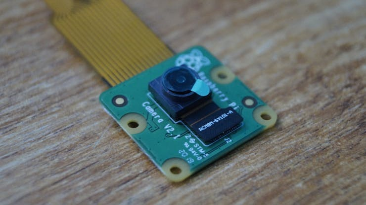
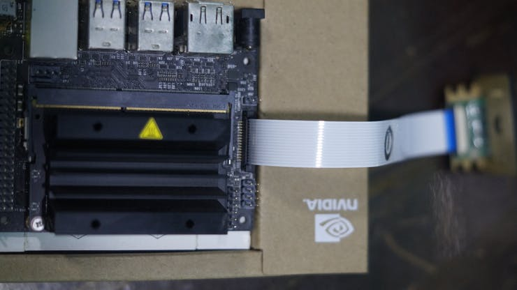
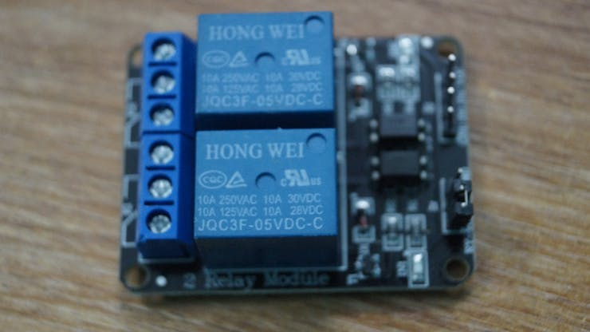
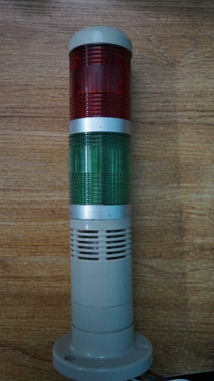
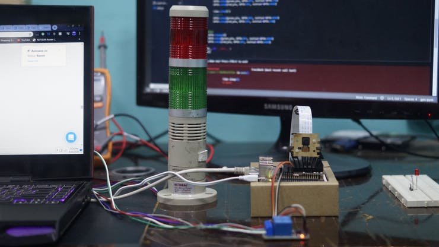
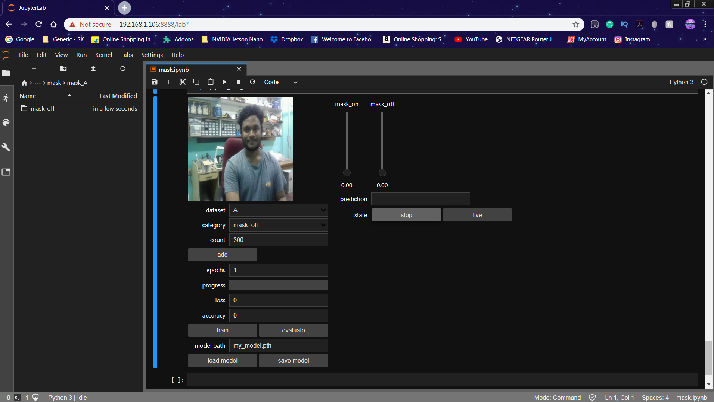
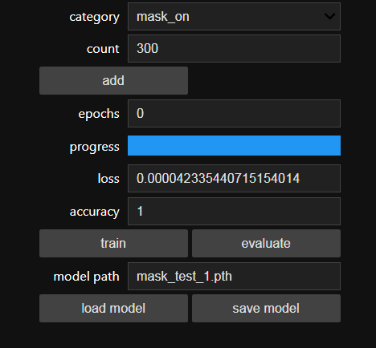
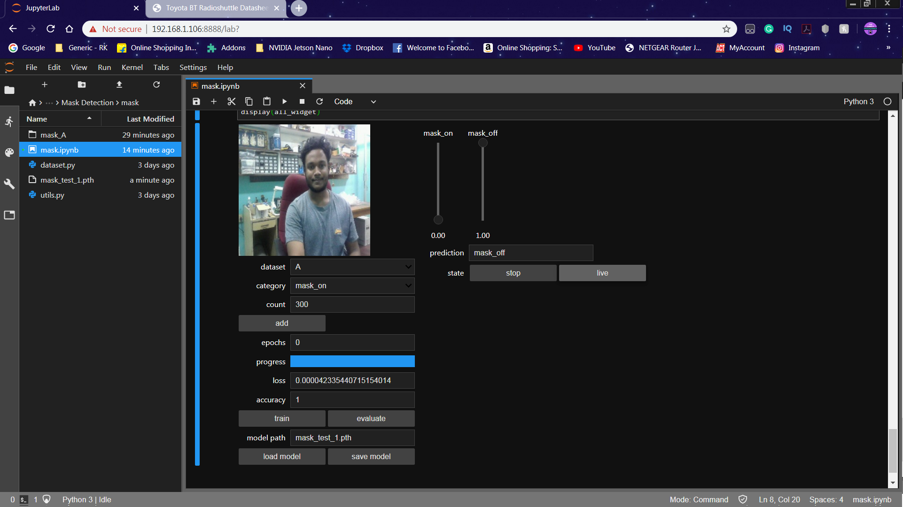
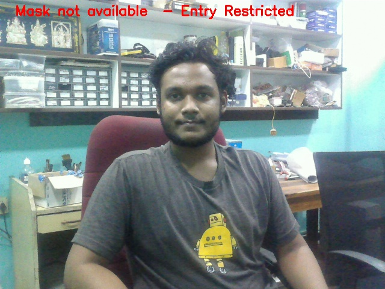
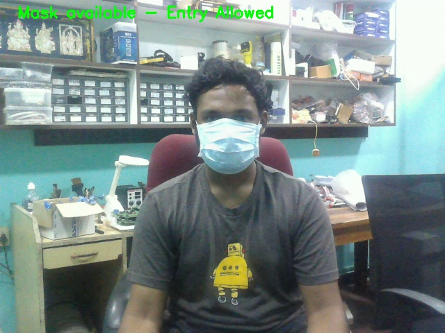

# COVID-19 - Authorized-Entry-using-Face-Mask-Detection

The system is designed to detect the faces and to determine whether the person wears a face mask or not. Using the above data, we can decide whether the concerned person can be allowed inside public places such as the market, or a hospital.

## Why Did We Build This?

"Prevention is better than cure" is one of the effective measures to prevent the spreading of COVID-19 and to protect mankind. Many researchers and doctors are working on medication and vaccination for corona.

To avoid getting infected or spreading it, It is essential to wear a face mask while going out from home especially to public places such as markets or hospitals.

## Requirements

### Hardware

* NVIDIA Jetson Nano
* Raspberry Pi Camera v2 or USB Camera
* Relay breakout board
* LED x 2
* Buzzer

### Software

*   NVIDIA DLI Image
*   OpenCV

## Block Diagram

The Block Diagram of this circuit is given below.


To make these connections, I've used separate connectors for power, and relay output.

### PI-CAMERA

The Raspberry Pi Camera is connected to the CSI port of the Jetson Nano.




### RELAY BOARD

We connect the Buzzer and an Emergency light using a relay circuit to the GPIO pins 18 & 23 of the Jetson Nano.



The Power Supply is used to deliver the power for the Status Light, Emergency Light, and the Alarm.


The Industrial grade Light Indicators and Buzzer are used to show the status and alert signal to the security (user).



| Relay Board            |  Jetson Nano  |
|-----------------------|---------------|
| Vcc |  +5V |
|-----------------------|---------------|
| IN1 (Pass Light) |  18 |
|-----------------------|---------------|
| IN2 (Alert Light & Buzzer) |  23 |
|-----------------------|---------------|
| GND |  GND |

The Industrial grade Light Indicators and Buzzer are connected to the GPIOs of the Jetson Nano.

The Overall connection is shown below.


## GPIO Integration 🔗

After reading a lot of forums, I tried to interface GPIO on the Jetson Nano. We need to install the Jetson GPIO Python library using the following command:

```
pip install Jetson.GPIO
```

If you face any issues in importing this package, do try the following command to import the package.
```
sudo -H pip install Jetson.GPIO
```


Import the Jetson GPIO package using the following command.
```
#import GPIO Lib
import Jetson.GPIO as GPIO
To interface Jetson Nano GPIO pins, I've started with a basic LED blink program.

output_pin = 18
GPIO.setmode(GPIO.BCM)
GPIO.setup(output_pin, GPIO.OUT, initial=GPIO.LOW)
curr_value = GPIO.LOW
try:
    while True:
        time.sleep(1)
        GPIO.output(output_pin, curr_value)
        curr_value ^= GPIO.HIGH
finally:
    GPIO.cleanup()
```

The GPIO Pins of Jetson Nano delivers only 3.3V. To toggle the relay, we need a 5V input. To solve this issue, we use an NPN transistor to level the output to 5V. Luckily, the Relay breakout board which I use has two transistors. The Relay Module triggers whenever a low pulse is given to the input.

```
if(prediction_widget.value == 'mask_on'):
    GPIO.output(access_pin, LOW)
    GPIO.output(alert_pin, HIGH)

if(prediction_widget.value == 'mask_off'):
    GPIO.output(access_pin, HIGH)
    GPIO.output(alert_pin, LOW)
```

## Camera Initialization 📷

Depending on the type of camera you're using (CSI or USB), the initialization is done as follows. First, the full reset of the camera is done by:
```
!echo 'dlinano' | sudo -S systemctl restart nvargus-daemon && printf '\n'
!ls -ltrh /dev/video* # Checks the device no
```

For the USB camera, the following lines are used. Note that, NVIDIA recommends Logitech C270 webcam, but Jetson Nano will also support other USB cameras.
```
from jetcam.usb_camera import USBCamera
camera = USBCamera(width=224, height=224, capture_device=0)
camera.running = True
```
For the PI camera, the following lines are used. I've used the Raspberry Pi Camera Module V2 in this project.
```
from jetcam.csi_camera import CSICamera
camera = CSICamera(width=224, height=224)
camera.running = True
```
Now the camera is initialized. Make sure that only one camera is active as the Jupyter notebook supports one camera at a time.

## Collecting the Dataset 🗄️

The first step in this project is data collection. The System has to identify the presence of masks and classify whether the person wears a mask or not.

Although most of the libraries are pre-installed, we install several libraries to the Jetson Nano using pip install <package_name> command.
```
torch
torchvision
dataset 
ipywidgets
traitlets
IPython
threading
time
```
Thanks to NVIDIA DLI, here we make some minor tweaks to the classification example and addition of GPIO interface to the project.
```
TASK = 'mask'
CATEGORIES = ['mask_on', 'mask_off']
DATASETS = ['A', 'B']
TRANSFORMS = transforms.Compose([
    transforms.ColorJitter(0.2, 0.2, 0.2, 0.2),
    transforms.Resize((224, 224)),
    transforms.ToTensor(),
    transforms.Normalize([0.485, 0.456, 0.406], [0.229, 0.224, 0.225])
])

datasets = {}
for name in DATASETS:
    datasets[name] = ImageClassificationDataset(TASK + '_' + name, CATEGORIES, TRANSFORMS)
```
We have installed all the required dependencies for this project. The Data-set is made by collections and arrangements of the images under the appropriate label.

For this project, we classify the image as either 'mask_on' or 'mask_off'. Initially, we created 300 images each for the dataset labels 'mask_on' or 'mask_off'. More Images were collected with different peoples and with a different background.




The image is captured for each label ('mask_on', 'mask_off').

## Designing a NN & Training the Model ⚒️⚙️

The Core of this project is an image classifier that classifies one of three categories. To make this Classifier, we use the pre-trained CNN (Convolutional Network) called ResNet18.

Here we use PyTorch and CUDA to generate the ResNet model which can identify the presence of a mask. The images which we generated in the previous step are used to train the model. The model is trained using the Dataset generated for a number of Epochs (Cycles) mentioned.

The model is configured with the hyperparameters as shown below.
```
device = torch.device('cuda')
model = torchvision.models.resnet18(pretrained=True)
model.fc = torch.nn.Linear(512, len(dataset.categories))
BATCH_SIZE = 8
optimizer = torch.optim.Adam(model.parameters())
```
While the model is training, you can find the loss and accuracy of the model for each Epoch and the accuracy increases at some point in time after a few Epoch.



Once the train button is pressed, the model will be trained using the selected Dataset for the given epochs. I've trained the model for epochs = 10 and saved the model.

It roughly took 10 minutes to generate the model with the highest accuracy after 10 epoch and that is really quick when compared to other hardware. Thanks to NVIDIA.

## Testing the Model ✅

Once the model is generated, It produces the output file "my_model.pth". This file is used as the source to test whether the system can identify the presence of masks and able to differentiate the people.

The camera reads the test image and transform the required color model, and then resize the image to 224 x 224 pixel (Same size used for model generation). The images which were used for training the model can be used to test the generated model.

Once the model is loaded and the image is acquired by the camera, the model predicts the captured image using the ResNet model loaded, and make the prediction for the mask detection.




The Prediction is displayed in the Text Label and the Slider is changed according to the prediction.

## Mask Detection Test

By taking a boolean into consideration, the presence of the mask is detected. The boolean is set to '1' when the prediction is mask_on. Similarly, the boolean is set to '0' when the prediction is mask_off.

A function is used to print the overlay to the captured image. The overlay text depends on the prediction value from the above step.

Some of the example images are shown below.





## Working of the Project 🔭

To test the real-time scenario, we deployed it on one of the rooms to test how possibly it could be used and the results were pretty affirmative.

[](https://youtu.be/2lwCU4bWY0c "Working of the Project - Click to Watch!")
